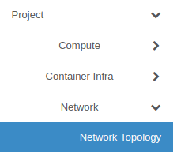
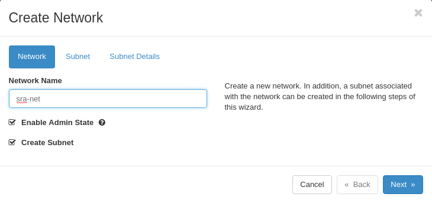
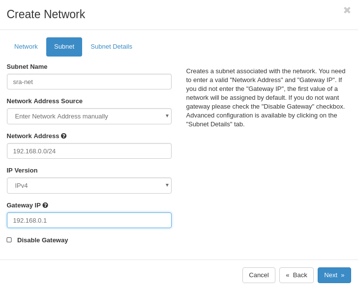
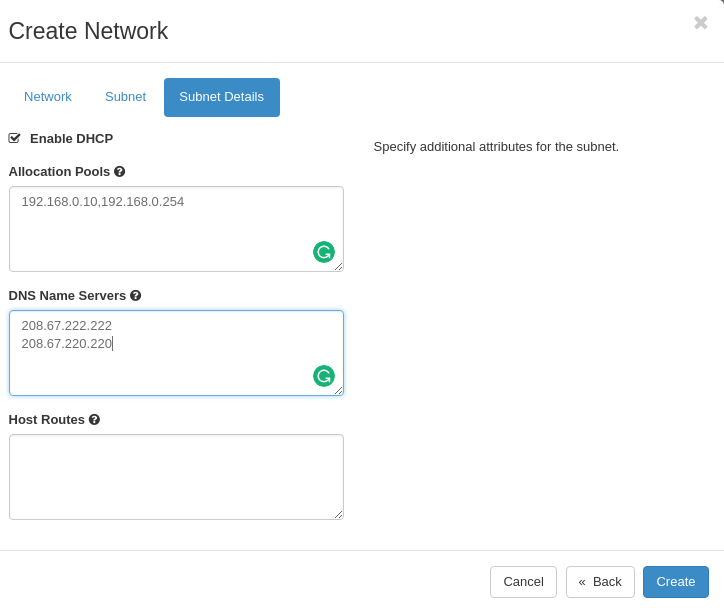
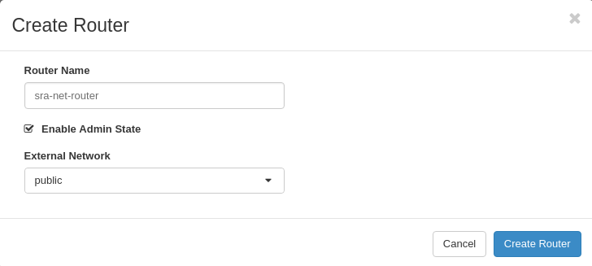
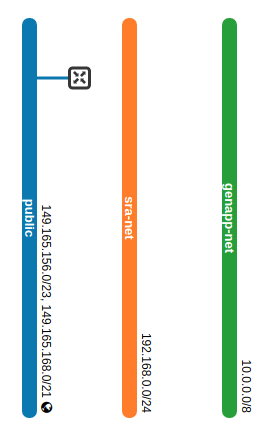
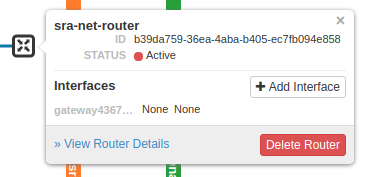
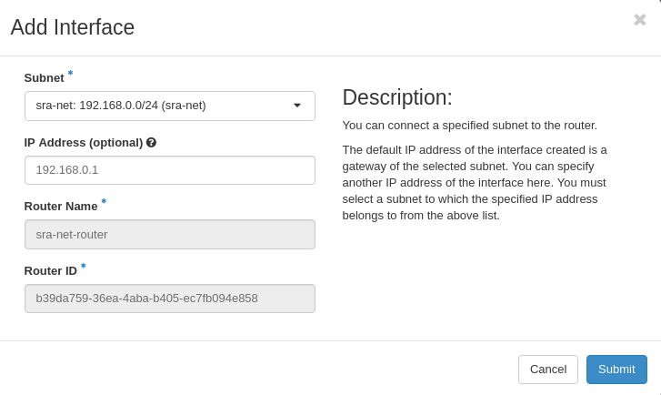
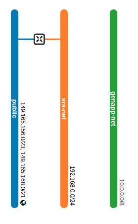

# Network Setup

Once you have logged into the [Jetstream API web interface](https://jblb.jetstream-cloud.org/dashboard/auth/login/?next=/dashboard/) click on Network -> Network Topology in the left hand menu:

Next, click create network in the top right hand corner, and then enter the details for this network.

The network will be called sra-net, and we will create a subnet.

Set the network addresses to be 192.168.0.0/24 and the gateway to be the first machine on that network: 192.168.0.1

Set the allocation pool to be 192.168.0.10,192.168.0.254. This should be more than enough machines and reserves IPs 192.168.0.1-9 for other things if needed.

For the DNS server, I've just used [OpenDNS](https://www.opendns.com)

# Router Setup

Next, we need to create a router to our public network.

Click the create router button on the top right, and enter a name for the router and connect it to your public network.

This creates a router from your public network that doesn't go anywhere:

Hover over the X and then click add interface:

Choose your network that you created earlier and enter the IP address of the gateway that you entered above (192.168.0.1)

Your network should be complete:

